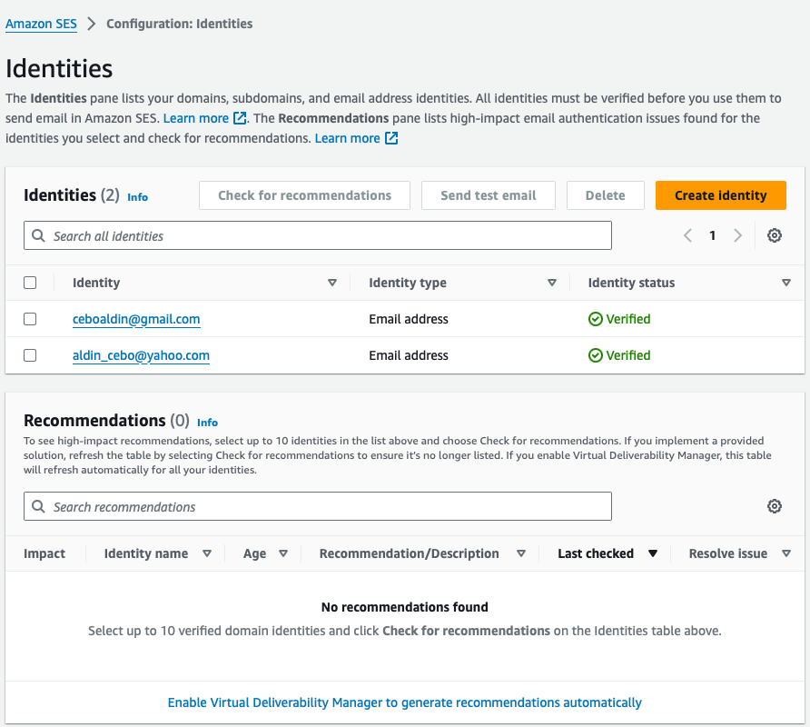

# Task 3: AWS Services

Set up an S3 bucket with proper access controls and configure SES to send an email notification when a new object is uploaded to the S3 bucket.

## Step 1: Create an S3 Bucket
- Create an S3 bucket with the name `task3bucket`.

## Step 2: Create a Role Using IAM (Identity Access Management)
- Create a role to access S3 and SES (Simple Email Service).
- Use CloudWatch for monitoring.

**Role name:** `Task3RoleFullAccessForS3AndSES`


## Step 3: Create a Lambda Function
- **Function name:** `Task3-S3LambdaFunction`
- **Runtime:** Python 3.9

We are using the “Execution role” -> `Task3RoleFullAccessForS3AndSES`.

### Add a Trigger to the Lambda Function
- Select S3 from the dropdown menu as the trigger.
- Connect to the bucket `s3/mytask6bucket`.
- Set the event type to “all object create events”.


### Code Section
```python
import boto3
from botocore.exceptions import ClientError

def send_email():
    """
    Sends an email notification using AWS SES when a new object is uploaded to an S3 bucket.
    """
    # Sender's email address (must be verified in AWS SES)
    SENDER = "your_email_address@example.com"
    
    # Recipient's email address (must be verified in AWS SES)
    RECIPIENT = "recipient_email_address@example.com"

    # AWS region where SES is configured
    AWS_REGION = "eu-central-1"

    # Email subject line
    SUBJECT = "New S3 Object Upload Notification"

    # Plain text body for email clients that do not support HTML
    BODY_TEXT = ("AWS S3 Notification\r\n"
                 "Dear User,\r\n"
                 "\r\n"
                 "This email is to inform you that a new object has been successfully uploaded to your S3 bucket.\r\n"
                 "\r\n"
                 "Best regards,\r\n"
                 "Your AWS Team"
                )
                
    # HTML body of the email
    BODY_HTML = """
    <html>
    <head></head>
    <body>
    <h1>AWS S3 Notification</h1>
    <p>Dear User,</p>
    <p>This email is to inform you that a new object has been successfully uploaded to your S3 bucket.</p>
    <p>Best regards,<br>
    Your AWS Team</p>
    </body>
    </html>
                """            

    # Character encoding for the email
    CHARSET = "UTF-8"

    # Create a new SES resource and specify the AWS region
    client = boto3.client('ses', region_name=AWS_REGION)

    # Try to send the email
    try:
        # Provide the contents of the email
        response = client.send_email(
            Destination={
                'ToAddresses': [
                    RECIPIENT,
                ],
            },
            Message={
                'Body': {
                    'Html': {
                        'Charset': CHARSET,
                        'Data': BODY_HTML,
                    },
                    'Text': {
                        'Charset': CHARSET,
                        'Data': BODY_TEXT,
                    },
                },
                'Subject': {
                    'Charset': CHARSET,
                    'Data': SUBJECT,
                },
            },
            Source=SENDER
        )
    except ClientError as e:
        # Print the error message if the email fails to send
        print(f"Error: {e.response['Error']['Message']}")
    else:
        # Print the Message ID of the sent email
        print(f"Email sent! Message ID: {response['MessageId']}")

def lambda_handler(event, context):
    """
    AWS Lambda handler function that triggers the send_email function.
    """
    send_email()
```

## Step 4: Verify Email Through SES
- Verify the email addresses for both the sender and the recipient through SES.



To generate our trigger to send an email notification we are going to upload a file to our S3 bucket


## Step 5: Verify through CloudWatch

in CloudWatch -> Log Groups -> Select Lambda function to view the log stream


After navigating to the Log events page, locate and click on the most recent log entry. Within this log, you should find an event detailing the email action. Click on the event to verify the "Email sent!" message. If this message is not displayed, the log will indicate any syntax errors or issues that need to be addressed.


We can verify by checking that the email was sent


