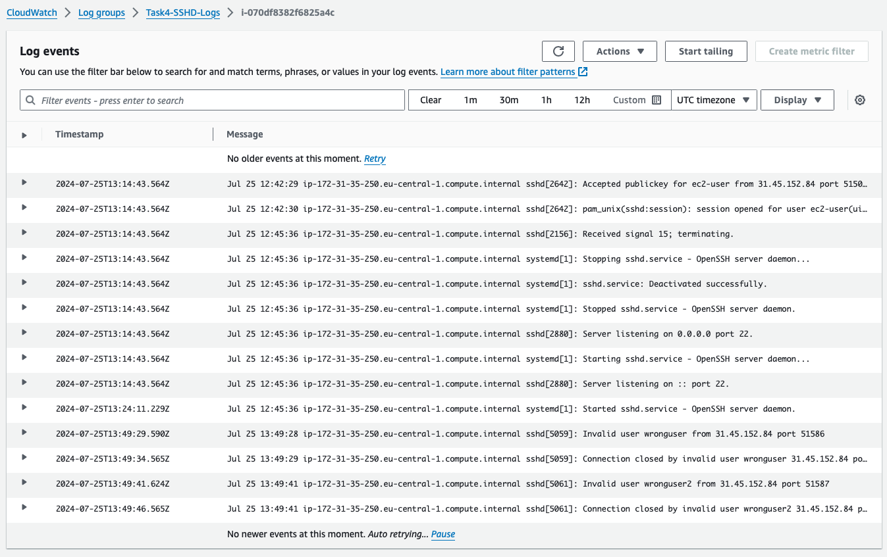
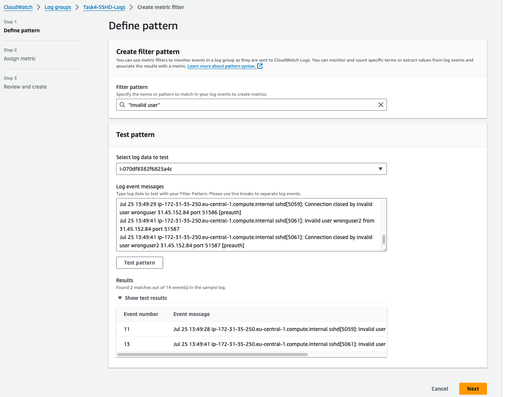
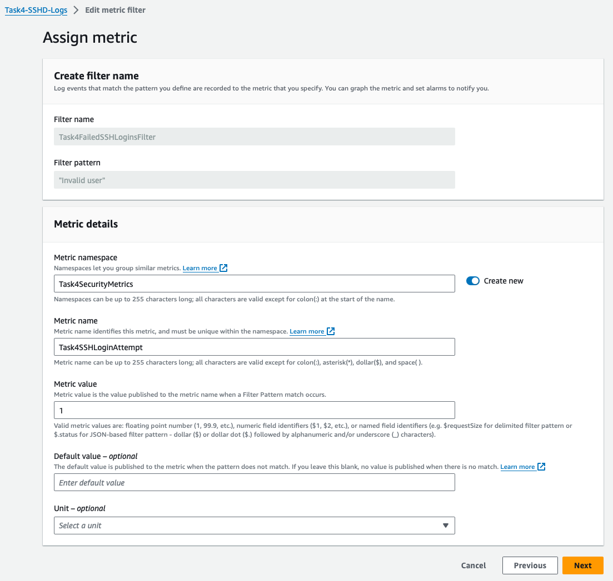
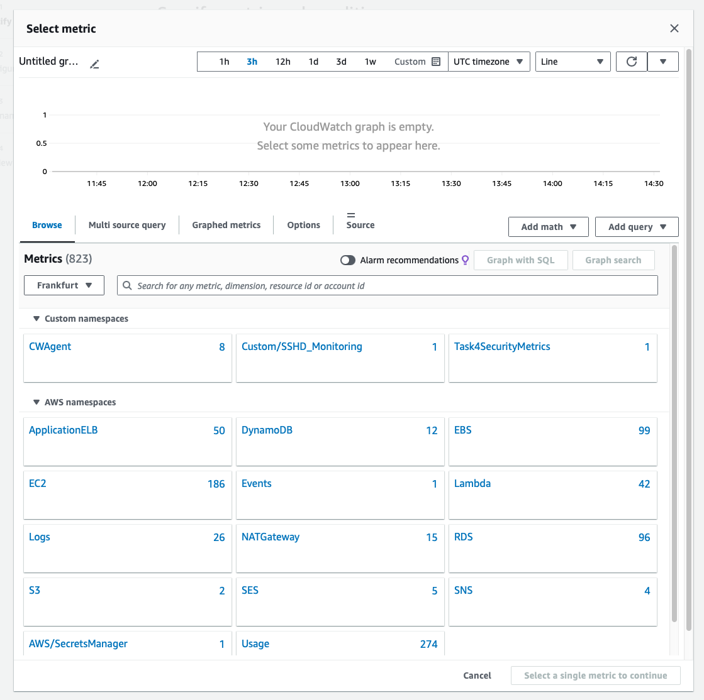
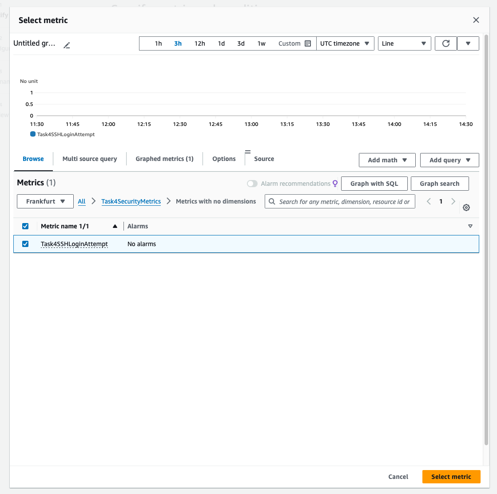
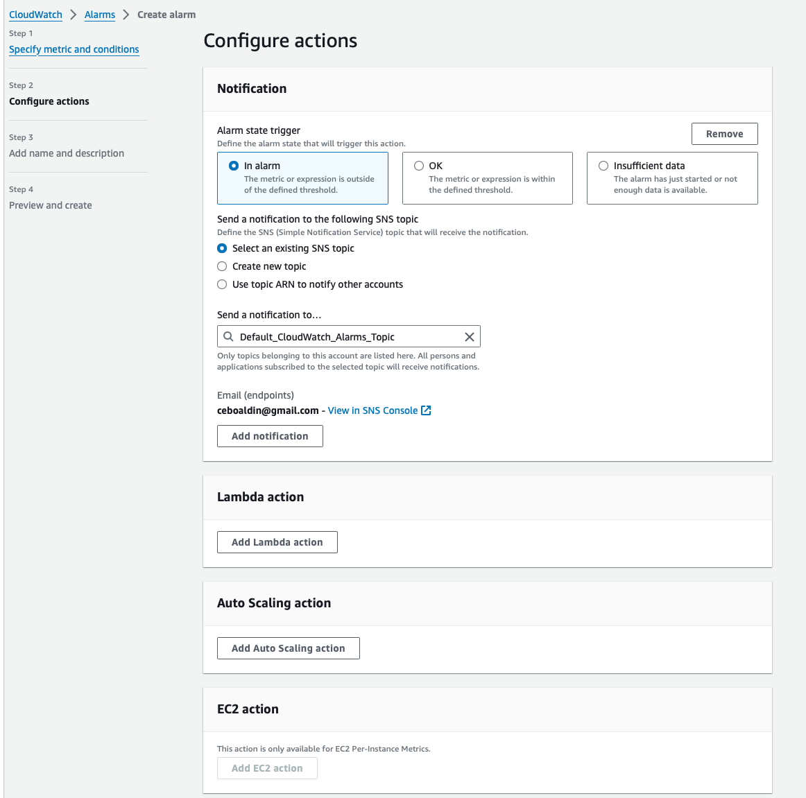
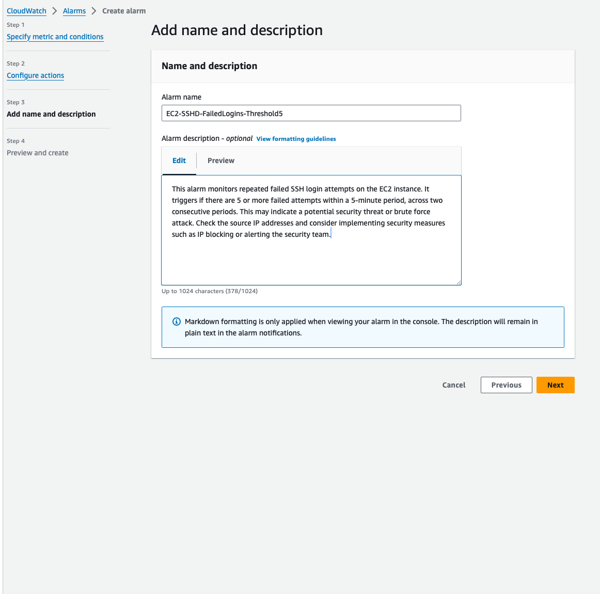
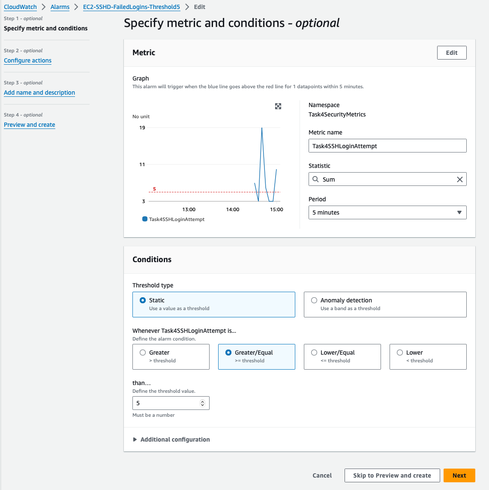

Task 4: Log Collection and Analysis

Configure AWS CloudWatch to collect logs from an EC2 instance and
set up an alarm for a specific log event (e.g., repeated failed login attempts).


## Step 1:
The first step is create EC2 instance:
- Software Image (AMI): Amazon Linux 2023 AMI 2023.5.20240722.0 x86_64 HVM kernel-6.1
- Instance type: t2.micro
- instance will be create in default VPC
- No preference (Default subnet in any availability zone)
- Auto-assign public IP = Enable
- Allowed SSH trafic from Anywhere 0.0.0.0/0

## Step 2: Configure EC2 instance

Get SSH events from EC2. On Amazon Linux 2023 AMI by default we dont have ```/var/log/secure``` for failed login attempts so we need to:

Check SSHD Config for Logging Settings
First, ensure that your SSH daemon is configured to log events. This is controlled by the SSHD configuration file typically found at `/etc/ssh/sshd_config`. 

Look for the following settings:
LogLevel: This should be set to ```INFO``` or ```VERBOSE``` to capture detailed logs, including failed authentication attempts. 

```bash
LogLevel INFO
```

After modifying sshd_config, restart the SSH service to apply changes:

```bash 
sudo systemctl restart sshd
```


Verify System Log Configuration
For systems using systemd, SSH logs are usually managed by systemd-journald. You can check SSH-related logs using:

```bash
journalctl _SYSTEMD_UNIT=sshd.service
```

Create a Service to Forward Logs
We will create a systemd service that continuously forwards logs from journalctl to a specified log file that the CloudWatch Logs agent can then monitor.

```bash
sudo mkdir -p /var/log/journal_logs
```

Create a service to forward logs:
Create a systemd service file that tails the sshd journal and writes it to a log file:

```bash
sudo vi /etc/systemd/system/journal-to-file.service
```

Insert the following configuration:

```conf
[Unit]
Description=Forward journal logs to a file
After=network.target

[Service]
ExecStart=/bin/sh -c '/usr/bin/journalctl -f -u sshd.service >> /var/log/journal_logs/sshd.log'
Restart=always
User=root

[Install]
WantedBy=multi-user.target
```

Save and exit the file.

Start the service:
```bash
sudo systemctl enable journal-to-file.service
sudo systemctl start journal-to-file.service
```

## Step 3 Instal and Configure CloudWatch Agent

Run the following commands to install the Unified CloudWatch Agent:

```bash 
sudo yum update -y 
sudo yum install amazon-cloudwatch-agent -y
```

Create a configuration file to specify which logs to collect. Monitor ```/var/log/journal_logs/sshd.log``` for failed login attempts:

```bash
sudo vi /opt/aws/amazon-cloudwatch-agent/bin/cwagent-config.json
```

and we use this configuration:

```json

{
    "agent": {
        "metrics_collection_interval": 60,
        "run_as_user": "cwagent"
    },
    "logs": {
        "logs_collected": {
            "files": {
                "collect_list": [
                    {
                        "file_path": "/var/log/journal_logs/sshd.log",
                        "log_group_name": "Task4-SSHD-Logs",
                        "log_stream_name": "{instance_id}"
                    }
                ]
            }
        }
    }
}

```

* remeber "log_group_name": "Task4-SSHD-Logs" because this will be important when we cum back on CloudWatch console 

Restart the CloudWatch agent:

```bash
sudo amazon-cloudwatch-agent-ctl -a stop
sudo amazon-cloudwatch-agent-ctl -a start
```

We need to use the amazon-cloudwatch-agent-ctl command to apply any changes to our CloudWatch agent configuration on the EC2 instance

```bash
sudo amazon-cloudwatch-agent-ctl -a fetch-config -m ec2 -c file:/opt/aws/amazon-cloudwatch-agent/bin/cwagent-config.json -s
```


## Step 4: Assign IAM Role:

In IAM Management Console.
We need to create a new role with the `CloudWatchAgentServerPolicy` policy attached.
And attach this role to our EC2 instance.


## Step 5: Create a Log Group in CloudWatch

Now in our Log Group we see Task4-SSHD-Logs, and in side of Task4-SSHD-Logs we can see Log streams



We can see when Invalid user try to login...


## Create CloudWatch Metric Filter:

Click on "Metric filters" then "Create metric filter".
In the "Filter pattern" box, input your chosen pattern ("Invalid user" for a simple match or the structured pattern if using fields).

Test the pattern to ensure it matches the log entries as expected.






## Create CloudWatch Alarm

Defining the alarm condition in AWS CloudWatch is a crucial step in the setup of monitoring and alerting based on our logs or metrics. This condition dictates when an alarm changes its state from OK to ALARM, which in turn can trigger notifications or other automated responses. Let's walk through how to define an alarm condition for the scenario of monitoring repeated failed SSH login attempts:








So if Threshold Crossed defined number we will get notification in email

